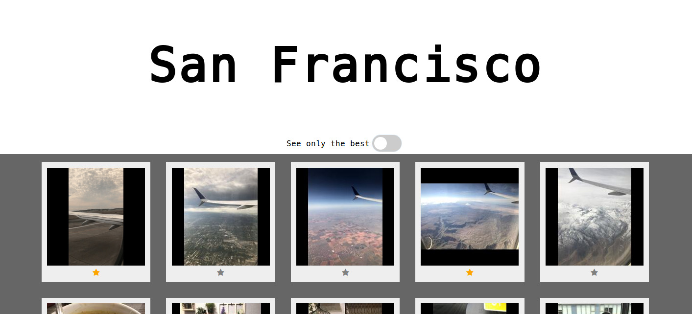

# Micro-gallery

A simple way to create a lightweight photo and video gallery



## Getting Started

This Flask application will read the photos and videos you want, automatically create thumbnails (animated GIFs for the videos), and serve a lightweight gallery to be shared easily even through poor connections.

### Usage

Put your files in the `static` folder of the application.
The structure should be as follow:

```
static/
  └─ pages/
     └─ gallery_1/
        ├─files/
        └─files.yaml
     └─ gallery_2/
        ├─files/
        └─files.yaml
```

with `gallery_1`, `gallery_2` being the different galleries you wish to create.

Each gallery contains a files.yaml configuration file:

```yaml
title: Étretat
best:
  - seagull
  - 3091
  - 3165
  - 3185
```

The configuration file contains the title of the gallery, and a list of "best" files used to add the golden star under each image and the possibility to show only these files in the gallery.
The "best" list is matched partially so you can put even just a part of the name.

when you run the application with `python app.py`, the thumbnails are created automatically for each file if they don't exist already. An animated gif is created for each video, and a reduced version of the photos are created for images.

The rendered gallery is meant to be very lightweight and simple, with no unnecessary dependencies, no js framework.

